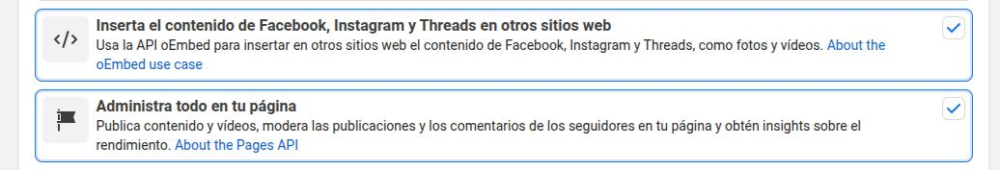
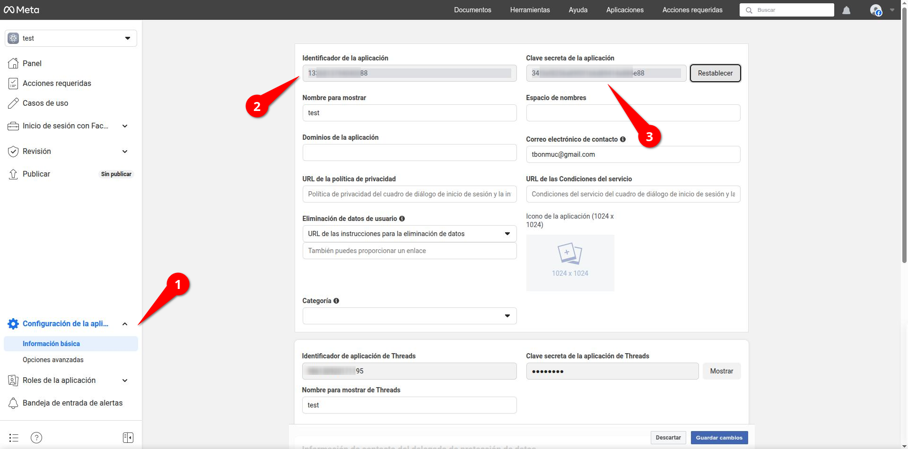
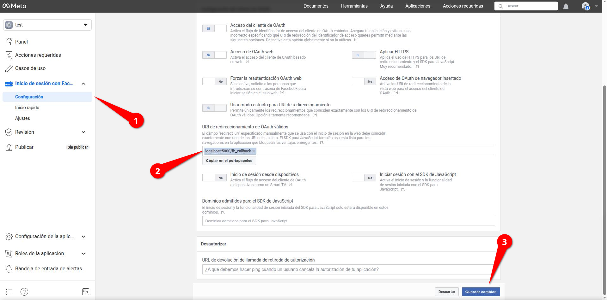
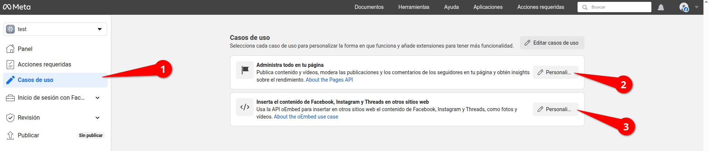
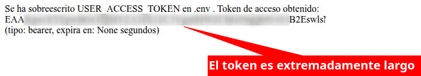

# Sobre este repositorio

Este repositorio trata de un bot en python hecho para interactuar con los comentarios usando inteligencia artificial para facturascripts.

## Montar el proyecto
utilizando el fichero `util.fish` escrito en fish-shell (similar a bash) se ha realizado macros para aligerar las tareas. Toda la información sobre **dependencias** y su uso está en ese fichero, es sencillo.

Básicamente revisar e instalar las herramientas necesarias y después ejecutar `./util.fish --init`, después `./util.fish --setup` y así se instalará el entorno de python y sus depencencias.

Después de eso se ingresa en [la página para desarrolladores de facebook](https://developers.facebook.com/apps/), se crea la cuenta.

En el proceso de creación la aplicación, debemos seleccionar las siguientes opciones:

Una vez creada la aplicación se procede a configurarla.

Copia el identificador y la clave secreta de la aplicación en este apartado:

Esos datos debes colocarlos en el fichero `.env` en **APP_ID** y **APP_SECRET_TOKEN** y no se comparten con nadie.

Después se coloca esta `localhost:5000/fb_callback` url de redireccionamiento en este apartado abajo del todo y se guardan los cambios (si no se realiza correctamente la aplicación dará error de que no hay un calback válido o no realizará el callback correctamente):

Finalmente otorgamos o añadimos todos los permisos a la aplicación para poder usarlos correctamente en la aplicación (si no se realiza correctamente o no se añaden los que se usan, la aplicación dará error en el registro avisando que esos permisos no son válidos o no existen):

Una vez realizadas esas acciones ya se puede comenzar.

Ejecuta `./util.fish --getToken`, abre la dirección en tu navegador y realiza el registro. Una vez realizado el registro se obtendrá un token (no se comparte con nadie) que se guardará automáticamente en `.env` y tendrá una validez normalmente de **60** días (puedes obtener más información sobre el token obtenido introduciéndolo en la [página de depuración de tokens de Facebook](https://developers.facebook.com/tools/debug/accesstoken/)).

Una vez realizado eso ya podemos ejecutar el bot lanzando la instrucción `./util.fish --run`.